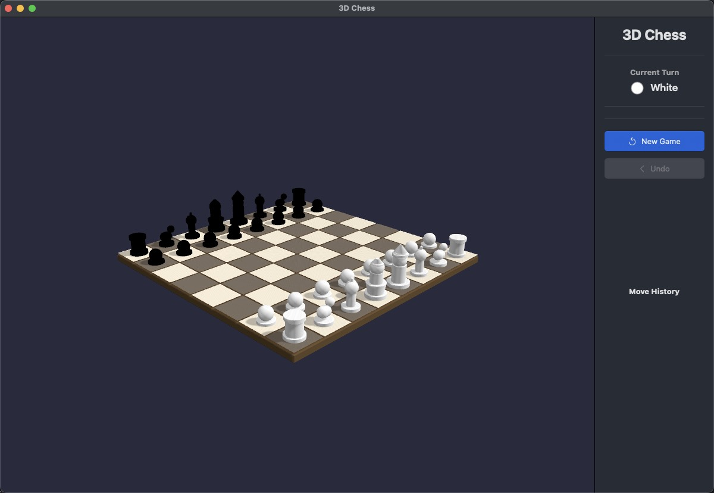

[English](README.md) | [中文](README.zh-CN.md)

# Chess3D - 3D 国际象棋

macOS 原生 3D 国际象棋游戏

## 运行界面



## 功能特性

- 🎮 3D 棋盘渲染 (SceneKit)
- ♟️ 6 种棋子几何体模型
- 📐 完整国际象棋规则
- 👆 点击选中/移动棋子
- ✨ 有效移动高亮显示
- 🖱️ 摄像机控制（旋转/缩放/平移）
- 📊 游戏状态显示

## 运行方式

### 在 Xcode 中运行

```bash
open Chess3D.xcodeproj
```

然后按 `Cmd + R` 运行

### 直接运行编译后的应用

```bash
open ~/Library/Developer/Xcode/DerivedData/Chess3D-*/Build/Products/Debug/Chess3D.app
```

### 使用终端命令运行

```bash
~/Library/Developer/Xcode/DerivedData/Chess3D-cmmpwuyvbkioryasqvebedqornda/Build/Products/Debug/Chess3D.app/Contents/MacOS/Chess3D
```

## 操作说明

- **点击棋子**：选中棋子
- **点击绿色高亮位置**：移动棋子
- **鼠标拖拽**：旋转视角
- **滚轮**：缩放视角
- **右键拖拽**：平移视角
- **菜单 → 游戏 → 新游戏**：重新开始
- **菜单 → 视图 → 重置摄像机**：恢复默认视角

## 项目结构

```
Chess3D/
├── App/
│   ├── AppDelegate.swift      # 应用生命周期
│   └── main.swift             # 入口点
├── Views/
│   ├── MainWindow.swift       # 主窗口
│   ├── ChessGameView.swift    # SceneKit 3D 视图
│   └── GameInfoView.swift     # 游戏信息面板
├── GameLogic/
│   ├── GameManager.swift      # 游戏状态管理
│   └── ChessBoard.swift       # 棋盘模型
└── Resources/
    └── Assets.xcassets        # 资源文件
```

## 技术栈

- Swift
- AppKit
- SceneKit (3D 渲染)
- SwiftChess (国际象棋规则)
- SwiftUI (信息面板)
- XcodeGen (项目构建)

## 构建要求

- macOS 12.0+
- Xcode 15.0+

## 构建项目

```bash
xcodegen generate
xcodebuild -project Chess3D.xcodeproj -scheme Chess3D -configuration Debug build
```

Happy Chess! ♟️
